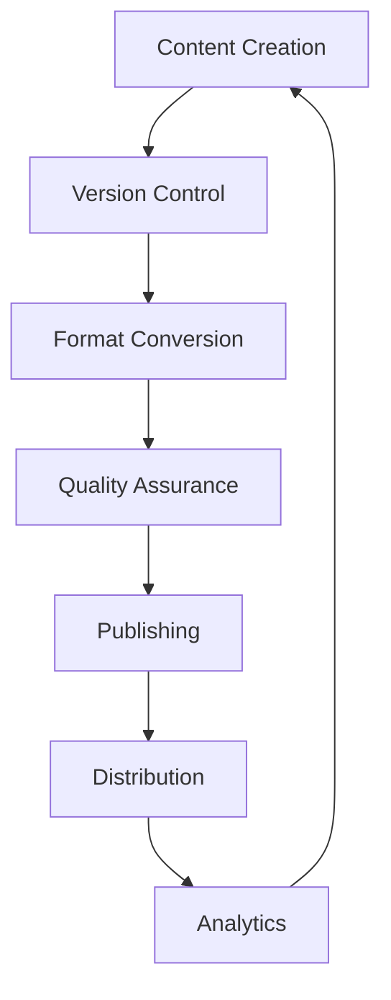

# AOPS System Overview

## 🌐 Three-Layer Architecture

### 1. Core Layer (Machine-Readable)
- **Format**: Markdown with YAML frontmatter
- **Features**: 
  - Version controlled
  - Modular structure
  - Rich metadata
  - AI-optimized

### 2. Human Layer (Consumption)
- **Formats**:
  - Web (HTML/CSS/JS)
  - PDF (Print-ready)
  - ePub (eBooks)
  - Audiobook (via TTS)
  - Print (Physical books)

### 3. AR Layer (Enhanced Experience)
- **Features**:
  - QR code triggers
  - 3D model viewers
  - Interactive timelines
  - Behind-the-scenes content

## 🔄 Workflow



## 🧩 Core Components

### 1. Book Structure
```
book-title/
├── meta.yaml          # Book metadata
├── chapters/          # Individual chapters
├── assets/            # Media files
└── templates/         # Custom templates
```

### 2. Build System
- **Input**: Markdown + YAML
- **Processing**: Pandoc + custom scripts
- **Output**: Multiple formats

### 3. Quality Assurance
- Automated testing
- Link validation
- Style checking
- Accessibility audit

## 📊 Metadata Schema

```yaml
---
book:
  title: "Realms Unbound"
  subtitle: "A Guide to Worldbuilding"
  version: 1.0.0
  authors:
    - name: "Jane Doe"
      role: "Author"
  publisher: "Arcanean Press"
  language: en
  publication_date: 2025-06-01
  description: "A comprehensive guide to creating immersive fantasy worlds"
  cover_image: assets/cover.jpg
  tags: [worldbuilding, fantasy, writing]
  license: CC-BY-NC-ND-4.0

build:
  formats: [web, pdf, epub, print]
  stylesheet: styles/main.css
  template: default
  output_dir: ../output

ar:
  enabled: true
  features:
    - 3d_models
    - audio_clips
    - interactive_maps
---
```

## 🚀 Getting Started

1. **Setup**
   ```bash
   git clone [repository]
   cd aops
   npm install
   ```

2. **Create New Book**
   ```bash
   node scripts/create-book.js "My New Book"
   ```

3. **Build**
   ```bash
   npm run build
   ```

4. **Preview**
   ```bash
   npm run serve
   ```

## 🔄 Update Workflow

1. Make changes to Markdown files
2. Run tests: `npm test`
3. Build outputs: `npm run build`
4. Commit changes: `git commit -am "Update content"`
5. Push to repository: `git push`
6. CI/CD pipeline handles deployment

## 📈 Analytics

Track:
- Most used prompts
- Reader engagement
- Format popularity
- User feedback

## 🔮 Future Roadmap

### Phase 1: Core System
- [x] Basic markdown processing
- [x] Multi-format output
- [ ] Automated testing

### Phase 2: Enhanced Features
- [ ] Interactive elements
- [ ] AR integration
- [ ] Community features

### Phase 3: AI Integration
- [ ] Prompt optimization
- [ ] Content suggestions
- [ ] Automated formatting

## 📚 Related Documents

- [Book Format Specification](./book-format.md)
- [Template Guide](./templates.md)
- [API Reference](./api.md)
